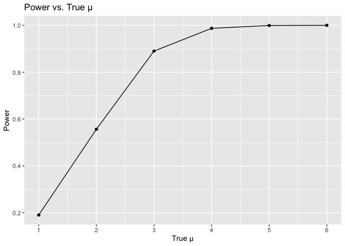

P8105 HW 5
================
Yuki Low (yl5503)
11/6/2023

Loading necessary libraries

``` r
library(tidyverse)
library(haven)
library(dplyr)
library(readxl)
library(janitor)
library(dplyr)
library(tidyr)
library(stringr)
library(broom)
library(purrr)
```

\#Question 2

``` r
complete_data <- list.files(path = "data", pattern = "csv", full.names = TRUE)

combined_df <- purrr::map(complete_data, read_csv) %>% 
  bind_rows() %>% 
  mutate(arm = as.factor(if_else(row_number() %in% c(1:10), "control", "experimental")),
  ID = row_number ()) %>%
  relocate(arm, ID, .before = "week_1") %>%
  pivot_longer (cols = week_1:week_8, names_to = "week", values_to = "observation") %>%
  separate(week, into = c("prefix", "week"), sep = "_") %>%
  mutate(week = as.integer(week)) %>%
  select(-prefix)

head(combined_df)
```

    ## # A tibble: 6 × 4
    ##   arm        ID  week observation
    ##   <fct>   <int> <int>       <dbl>
    ## 1 control     1     1        0.2 
    ## 2 control     1     2       -1.31
    ## 3 control     1     3        0.66
    ## 4 control     1     4        1.96
    ## 5 control     1     5        0.23
    ## 6 control     1     6        1.09

``` r
ggplot(combined_df, aes(x = week, y = observation, group = ID, color = arm)) +
  geom_line() +
  labs(x = "Week", y = "Observation", color = "Arm", title = "Spaghetti Plot of Observations Over Time" )
```

<!-- -->

From the spaghetti plot, we can see that, on average, the observations
for the experimental arm are higher than the observations for the
control arm. We can also see that over the weeks, the observations for
the experimental are increasing whereas the observations for the control
arm are relatively stable.

\#Question 3

``` r
set.seed(123)

t_test <- function(mu = 0) {
  sample <- tibble(rnorm(n = 30, mean = mu, sd = 5))
  
  results <- t.test(sample) %>% 
    broom::tidy() %>% 
    select(estimate, p.value)
  results
}

mean_0 <- expand_grid(mean = 0, 
                      iteration = 1:5000) %>% 
  mutate(results = map(mean, t_test)) %>% 
  unnest(results)

mean_rest <- expand_grid(mean = 1:6, 
                        iteration = 1:5000) %>% 
  mutate(results = map(mean, t_test)) %>% 
  unnest(results)
```

``` r
mean_rest %>%
  group_by(mean) %>% 
  summarize(prop_rejected = sum(p.value < 0.05)/5000) %>% 
  ggplot(aes(x = mean, y = prop_rejected)) + 
  geom_point() + 
  geom_path() +
  scale_x_continuous(limits = c(1,6), breaks = seq(1,6,1)) + 
  labs(x = "True μ", y = "Power", title = "Power vs. True μ")
```

<!-- --> As
effect size increases, statistical power also increases.

``` r
avg_estimate <- mean_rest %>% 
  group_by(mean) %>% 
  summarize(average_estimate = mean(estimate, na.rm = T)) %>% 
  ungroup()

avg_estimate
```

    ## # A tibble: 6 × 2
    ##    mean average_estimate
    ##   <int>            <dbl>
    ## 1     1             1.01
    ## 2     2             1.99
    ## 3     3             3.01
    ## 4     4             3.98
    ## 5     5             4.98
    ## 6     6             5.99

``` r
avg_rejected_estimate <- mean_rest %>% 
  filter(p.value < 0.05) %>% 
  group_by(mean) %>% 
  summarize(average_estimate = mean(estimate, na.rm = T)) %>% 
  ungroup()

avg_rejected_estimate
```

    ## # A tibble: 6 × 2
    ##    mean average_estimate
    ##   <int>            <dbl>
    ## 1     1             2.23
    ## 2     2             2.60
    ## 3     3             3.20
    ## 4     4             4.01
    ## 5     5             4.99
    ## 6     6             5.99

``` r
ggplot(avg_estimate, aes(x = mean, y = average_estimate)) +
  geom_line(data = avg_estimate, aes(color = "pink")) +
  geom_line(data = avg_rejected_estimate, aes(color = "cyan")) +
  scale_color_manual(name = " ", values = c("cyan" = "cyan", "pink" = "pink"),
                     labels = c('Rejected Estimates','All Estimates')) +
  geom_point(data = avg_estimate, color = "pink") +
  geom_point(data = avg_rejected_estimate, color = "cyan") +
  scale_x_continuous(limits = c(1,6), breaks = seq(1,6,1)) +
  labs(x = " True μ", y = "Average Estimate of μ", title = "Average Estimate of μ vs. True μ")
```

<!-- -->

For the rejected estimates, the average estimates of mean approached the
true mean as the true mean increased. For all estimates, the average
estimates of the mean matched the true mean.
